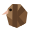

# kf-extensions

Editor extensions for [KFlat](https://github.com/komp-co/kf-lang).

| Directory | Editor |
|---|---|
| [`vscode/`](vscode/) | Visual Studio Code: highlighting, file icons, and every editor feature through the language server, `komp lsp` |

The highlighting grammar is generated from the compiler's own lexer tables, so
the generator reads a komp checkout: `komp` beside this repository, or the one
`KOMP_REPO` names. The language server itself, for VS Code, Neovim
and any other LSP client, is [kf-lsp](https://github.com/komp-co/kf-lsp).
